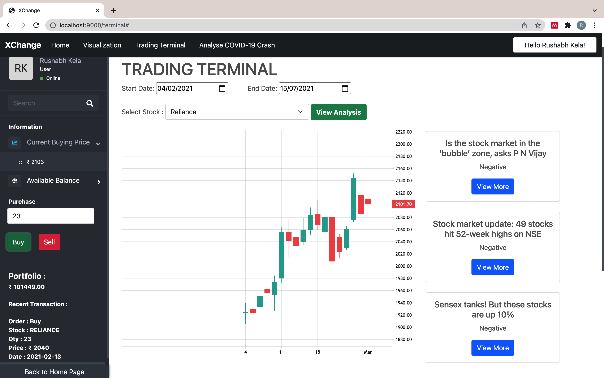

<div id="top"></div>

<br />
<div align="center">
  <a href="https://github.com/rushabhkela/XChange">
    
  </a>

  <h3 align="center">XChange</h3>

  <p align="center">
    A Unique Stock Market Trading Terminal
    <br />
    <a href="https://github.com/rushabhkela/XChange"><strong>Explore the docs »</strong></a>
    <br />
    <br />
    <a href="https://github.com/rushabhkela/XChange">View Demo</a>
    ·
    <a href="https://github.com/rushabhkela/XChange/issues">Report Bug</a>
    ·
    <a href="https://github.com/rushabhkela/XChange/issues">Request Feature</a>
  </p>
</div>


<!-- TABLE OF CONTENTS -->
<details>
  <summary>Table of Contents</summary>
  <ol>
    <li>
      <a href="#about-the-project">About The Project</a>
      <ul>
        <li><a href="#built-with">Built With</a></li>
      </ul>
    </li>
    <li>
      <a href="#getting-started">Getting Started</a>
      <ul>
        <li><a href="#prerequisites">Prerequisites</a></li>
        <li><a href="#installation">Installation</a></li>
      </ul>
    </li>
    <li><a href="#usage">Usage</a></li>
    <li><a href="#roadmap">Roadmap</a></li>
    <li><a href="#contributing">Contributing</a></li>
    <li><a href="#license">License</a></li>
    <li><a href="#contact">Contact</a></li>
    <li><a href="#acknowledgments">Acknowledgments</a></li>
  </ol>
</details>


<!-- ABOUT THE PROJECT -->
## About The Project


With the increase in the count of new retail investors in Stock Market there was also a problem rising suddenly, lack of guidance and experience. 
People start believing easily on tips and tricks and made short term profits, but today markets are at all time high. 
What Now and How ??

XChange is a One Stop Solution for a individual to plan and succeed his `Financial Journey`.
XChange is a stock market terminal with all the features one needs to ace his journey of stock trading. It has a virtual trading terminal, a visualisation dashboard, and historical pattern analysis of a huge collection of stocks.

This will give the user an insight of the stock market fundamentals, risks and benefits associated with it.
Key Features :
* Users can easily visualize the data here and can read and do fundamental analysis of any company. The company information, an all-time candlestick intraday chart, technical analysis indicators, 52-Week High, Low Prices, P/E ratio are displayed to the user.
* The, our unqiue **Trading Terminal** provides users the access to fetch the historical data with selected date range and analyze the news and the technical chart on the same dashboard of the terminal. To put it in simple words, when a user enters a date range and his preferred stock, the chart will update in every 3 seconds (that represents 1 day in that time duration). The news is also displayed to the user along with the sentiment analysis (postive, negative, neutral) so that the user can understand how the particular news might have affected the stock prices at that moment.
* A virtual amount of INR 1,00,000 is provided to the user, for him/her to invest and observe his portfolio according to the timeframe he has put.
* A graph of important stock market events is provided to the user, so that the user can analyse those incidents and take informed decisions in his real stock trading journey, when situations aren't favourable.


<p align="right">(<a href="#top">back to top</a>)</p>


### Built With

This project was built with the following frameworks and technologies:

* [Node.js](https://nodejs.org/en/)
* [Express Framework](https://expressjs.com/)
* [MongoDB](https://www.mongodb.com/)
* [Bootstrap](https://getbootstrap.com)
* [Javascript](https://www.w3schools.com/js/)
* [JQuery](https://jquery.com)
* [NSEDownload Python Library (to obtain historical stock market data)](https://github.com/NSEDownload/NSEDownload)
* [Trading View APIs](https://in.tradingview.com/)


<p align="right">(<a href="#top">back to top</a>)</p>


<!-- GETTING STARTED -->
## Getting Started

Follow the steps given below to run the project locally on your system.

### Prerequisites

* npm
  ```sh
  npm install npm@latest -g
  npm install nodemon@latest -g
  ```

### Installation

_Once all the prerequisites are met, the required API Keys and dependencies must be installed._

1. Get a free Google OAuth API Key at [https://cloud.google.com/](https://cloud.google.com/)
2. Add the URIs `http://localhost:9000` in `Authorized JavaScript origins` tab, and `http://localhost:9000/auth/google`, `http://localhost:9000/auth/google/callback` in `Authorized redirect URIs` tab.
3. Create a free MongoDB Atlas cluster at [https://www.mongodb.com/atlas](https://www.mongodb.com/atlas)
4. Clone the repo
   ```sh
   git clone https://github.com/rushabhkela/XChange.git
   ```
3. Install NPM packages
   ```sh
   npm install
   ```
4. Create the .env file
   ```sh
   cp .env.example .env
   ```
5. In the .env file, enter your credentials generated in the above steps (google OAuth details can be found in the google cloud console and mongoDB access URI from the mongoDB cluster dashboard ).
6. Good to go! Start the project locally using the following command, and go to [http://localhost:9000](http://localhost:9000)
4. Enter your API in `config.js`
   ```sh
   npm start
   ```

<p align="right">(<a href="#top">back to top</a>)</p>


<!-- USAGE EXAMPLES -->
## Usage
### Trading Terminal

<div align="center">
    
    <br>
</div>

### Visualisation Dashboard

<div align="center">
    
    
    
    <br>
</div>


<p align="right">(<a href="#top">back to top</a>)</p>


<!-- ROADMAP -->
## Roadmap

- [x] Think of a unique idea!
- [x] Implement the project.
- [x] Add a README.md
- [ ] Deploy the project
- [ ] Expand the scope of the project, to other areas that might help users in their stock market trading.

See the [open issues](https://github.com/rushabhkela/XChange/issues) for a full list of proposed features (and known issues).

<p align="right">(<a href="#top">back to top</a>)</p>


<!-- CONTRIBUTING -->
## Contributing

Contributions are what make the open source community such an amazing place to learn, inspire, and create. Any contributions you make are **greatly appreciated**.

If you have a suggestion that would make this better, please fork the repo and create a pull request. You can also simply open an issue with the tag "enhancement".
Don't forget to give the project a star! Thanks again!

1. Fork the Project
2. Create your Feature Branch (`git checkout -b feature/AmazingFeature`)
3. Commit your Changes (`git commit -m 'Add some AmazingFeature'`)
4. Push to the Branch (`git push origin feature/AmazingFeature`)
5. Open a Pull Request

<p align="right">(<a href="#top">back to top</a>)</p>


<!-- LICENSE -->
## License

Distributed under the MIT License. See `LICENSE.txt` for more information.

<p align="right">(<a href="#top">back to top</a>)</p>


<!-- CONTACT -->
## Contact

Rushabh Kela - +91 9834473257 - kelarushabh@gmail.com

Project Link: [https://github.com/rushabhkela/XChange](https://github.com/rushabhkela/XChange)

<p align="right">(<a href="#top">back to top</a>)</p>


<!-- ACKNOWLEDGMENTS -->
## Acknowledgments

* [Choose an Open Source License](https://choosealicense.com)
* [Font Awesome](https://fontawesome.com)
* [Trading View Charts](https://in.tradingview.com/)
* [DevJams'21](https://dscvit.com/)

<p align="right">(<a href="#top">back to top</a>)</p>
